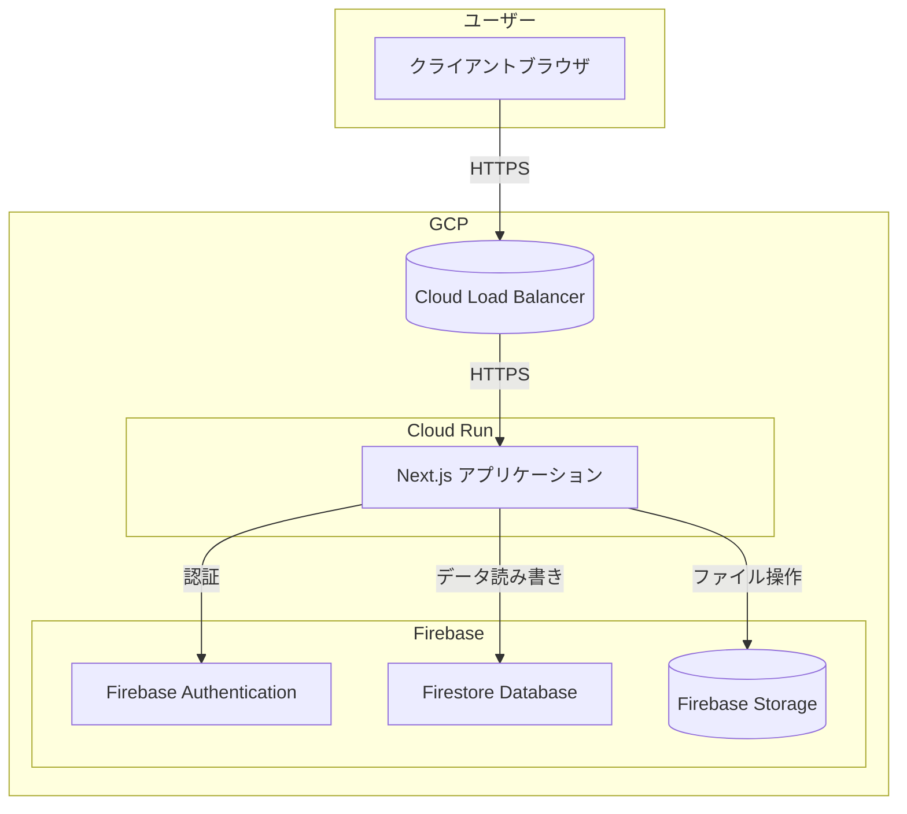

# 基本設計書: Job Matching SaaS

## 1. 概要

本ドキュメントは、求職者と求人情報をマッチングさせるSaaSアプリケーションの基本設計を定義する。
Next.jsフレームワークを使用し、フロントエンドとバックエンドAPIを構築する。データベースにはGCP Firebase (Firestore) を採用し、インフラストラクチャはCloud Runを用いたサーバーレスアーキテクチャとする。

## 2. 機能要件

既存の `app/` ディレクトリ構成と `components/` 内の要素から、以下の主要機能が想定される。

### 2.1. ダッシュボード ( `/` )
-   アプリケーション全体の統計情報や概要を表示する (`dashboard-stats`, `recruitment-stats`)。
-   最近のマッチング情報を表示する (`recent-matches`)。

### 2.2. 候補者管理 ( `/candidates` )
-   **候補者一覧:**
    -   候補者情報をテーブル形式で表示する (`candidates-table`)。
    -   候補者の概要（総数など）を表示する (`candidates-overview`)。
    -   スキル、経験、ステータスなどで候補者をフィルタリングする (`candidates-filter`)。
-   **候補者詳細 (想定):**
    -   特定の候補者の詳細情報を表示する。
    -   候補者が応募している求人情報を表示する (`candidate-jobs`)。
    -   候補者の面接スケジュールや結果を表示する (`candidate-interviews`)。
-   **候補者登録/編集 (想定):**
    -   新しい候補者情報を登録、既存情報を編集する。

### 2.3. 求人管理 ( `/jobs` )
-   **求人一覧:**
    -   求人情報をテーブル形式で表示する (`jobs-table`)。
    -   求人の概要（掲載数など）を表示する (`jobs-overview`)。
    -   職種、勤務地、ステータスなどで求人をフィルタリングする (`jobs-filter`)。
-   **求人詳細 (想定):**
    -   特定の求人の詳細情報を表示する。
    -   求人に応募している候補者情報を表示する (`job-candidates`)。
-   **求人登録/編集 (想定):**
    -   新しい求人情報を登録、既存情報を編集する。
-   **求人分析:**
    -   求人カテゴリごとの分布をチャート表示する (`job-category-chart`)。
    -   求人のタイムライン（掲載開始、終了など）を表示する (`job-timeline`)。

### 2.4. マッチング管理 ( `/matching` )
-   **マッチングボード:**
    -   候補者と求人のマッチング状況をボード形式（例: ドラッグ＆ドロップ）で管理する (`matching-board`)。
    -   マッチング候補をフィルタリングする (`matching-filter`)。
-   **最近のマッチング:**
    -   成立したマッチングの履歴を表示する (`recent-matches` - ダッシュボードと共通コンポーネント)。

### 2.5. 面接管理 ( `/interviews` )
-   **面接一覧:**
    -   面接スケジュールや結果をテーブル形式で表示する (`interviews-table`)。
    -   面接のステータスなどでフィルタリングする (`interviews-filter`)。
-   **面接タイムライン:**
    -   面接のスケジュールを時系列で表示する (`interviews-timeline`)。

### 2.6. レポート/統計 ( `/reports` )
-   **採用統計:**
    -   採用活動全体の主要指標（応募数、面接数、内定数など）を表示する (`recruitment-stats` - ダッシュボードと共通コンポーネント)。
    -   月次の採用トレンドをチャート表示する (`monthly-hiring-chart`)。
    -   成果の高いリクルーターを表示する (`top-recruiters`)。

### 2.7. 共通機能
-   **ヘッダー:** ナビゲーション、ユーザー情報などを表示する (`header`)。
-   **サイドバー:** 主要機能へのナビゲーションを提供する (`sidebar`)。
-   **認証 (想定):** ユーザーログイン、ログアウト機能。Firebase Authentication を利用。
-   **テーマ:** アプリケーションのテーマ（ライト/ダーク）を管理する (`theme-provider`)。

## 3. 非機能要件

-   **パフォーマンス:** 主要画面は3秒以内に表示完了することを目指す。Firestoreの適切なインデックス設計、Next.jsのサーバーサイドレンダリング(SSR)や静的サイト生成(SSG)を適宜活用する。
-   **スケーラビリティ:** Cloud RunとFirestoreの自動スケーリング機能を活用し、ユーザー数やデータ量の増加に対応できる設計とする。
-   **可用性:** GCPのインフラを利用し、高い可用性を確保する。Cloud Run、FirestoreのSLAに準拠する。
-   **セキュリティ:**
    -   Firebase Authenticationによる安全な認証・認可。
    -   Firestoreセキュリティルールによる適切なデータアクセス制御。
    -   Cloud Runでのセキュアなコンテナ運用。
    -   入力値のバリデーション、XSS対策など、基本的なWebセキュリティ対策。
-   **保守性:**
    -   コンポーネントベースの設計 (React/Next.js)。
    -   TypeScriptによる型安全な開発。
    -   適切なテストコードの記述。
    -   可読性の高いコード、適切なコメント。
-   **開発効率:** Next.js、Firebase、Cloud Runのエコシステムを活用し、効率的な開発を目指す。

## 4. アーキテクチャ

Cloud RunとFirebaseを中心としたサーバーレスアーキテクチャを採用する。

-   **フロントエンド & バックエンドAPI:** Next.jsアプリケーションを単一のコンテナイメージとしてビルドし、Cloud Runサービスとしてデプロイ・実行する。
    -   UIレンダリング (SSR/SSG/CSR)
    -   API Routesによるバックエンドロジック
-   **データベース:** Firestoreをメインのデータベースとして使用する。NoSQLの特性を活かし、柔軟なデータ構造を管理する。
-   **認証:** Firebase Authenticationを利用し、メールアドレス/パスワード認証、ソーシャルログインなどを実装する。認証情報はクライアントとサーバーサイド(API Routes)で共有・検証する。
-   **静的ファイル配信:** Next.jsが生成する静的アセット（JS, CSS, 画像など）は、Cloud Runサービスから直接配信される。必要に応じてCloud CDNを前段に置くことも検討。
-   **ファイルストレージ (オプション):** 履歴書などのファイルアップロード機能が必要な場合は、Firebase Storageを利用する。
-   **スケーリング:** Cloud Runはリクエスト数に応じて自動でコンテナインスタンス数を増減させる。Firestoreも負荷に応じて自動スケールする。

## 5. データベース設計 (Firestore)

主要なコレクション構成案を示す。ドキュメント内のフィールドは代表的なもののみ記載。

-   **`users`** (ドキュメントID: Firebase Auth UID)
    -   `email`: String
    -   `displayName`: String
    -   `role`: String (`admin`, `recruiter`, `viewer` など)
    -   `createdAt`: Timestamp
    -   `updatedAt`: Timestamp
-   **`candidates`** (ドキュメントID: 自動生成ID)
    -   `name`: String
    -   `email`: String
    -   `phone`: String
    -   `skills`: Array<String>
    -   `experienceYears`: Number
    -   `status`: String (`new`, `screening`, `interviewing`, `hired`, `rejected`)
    -   `resumeUrl`: String (Firebase Storageへのパス)
    -   `addedBy`: DocumentReference (`users`)
    -   `createdAt`: Timestamp
    -   `updatedAt`: Timestamp
    -   **サブコレクション:**
        -   `appliedJobs`: (ドキュメントID: `jobId`) - 応募した求人への参照
            -   `jobRef`: DocumentReference (`jobs`)
            -   `appliedAt`: Timestamp
        -   `interviews`: (ドキュメントID: `interviewId`) - 面接への参照
            -   `interviewRef`: DocumentReference (`interviews`)
            -   `scheduledAt`: Timestamp
-   **`jobs`** (ドキュメントID: 自動生成ID)
    -   `title`: String
    -   `description`: String
    -   `category`: String
    -   `location`: String
    -   `status`: String (`open`, `closed`, `draft`)
    -   `postedBy`: DocumentReference (`users`)
    -   `createdAt`: Timestamp
    -   `updatedAt`: Timestamp
    -   **サブコレクション:**
        -   `applicants`: (ドキュメントID: `candidateId`) - 応募者への参照
            -   `candidateRef`: DocumentReference (`candidates`)
            -   `appliedAt`: Timestamp
-   **`interviews`** (ドキュメントID: 自動生成ID)
    -   `candidateRef`: DocumentReference (`candidates`)
    -   `jobRef`: DocumentReference (`jobs`)
    -   `interviewerRef`: DocumentReference (`users`)
    -   `scheduledAt`: Timestamp
    -   `status`: String (`scheduled`, `completed`, `canceled`)
    -   `feedback`: String
    -   `createdAt`: Timestamp
    -   `updatedAt`: Timestamp
-   **`matches`** (ドキュメントID: 自動生成ID)
    -   `candidateRef`: DocumentReference (`candidates`)
    -   `jobRef`: DocumentReference (`jobs`)
    -   `matchedBy`: DocumentReference (`users`)
    -   `matchedAt`: Timestamp
    -   `status`: String (`pending`, `approved`, `rejected`)
    -   `createdAt`: Timestamp

**考慮事項:**
-   Firestoreのクエリ効率を考慮し、非正規化（データの重複保持）を適宜検討する。例えば、`candidates` ドキュメント内に `appliedJobTitles` のようなフィールドを持つなど。
-   セキュリティルールを適切に設定し、ロールに応じたアクセス制御を行う。

## 6. その他
-   **開発ツール:** TypeScript, ESLint, Prettier
-   **UIコンポーネント:** Shadcn/ui (既存構成から推測)
-   **テスト:** Jest, React Testing Library, Cypress (検討)
